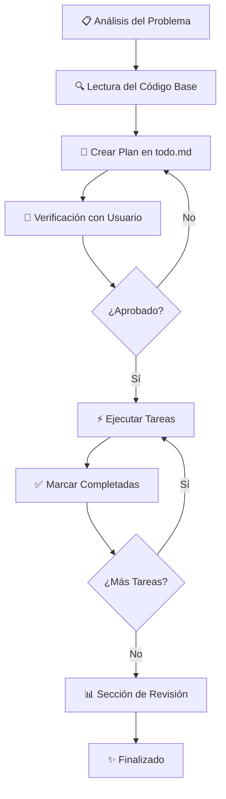

# Reglas de Desarrollo - Workflow Obligatorio

Este documento define el workflow obligatorio que debe seguirse para **TODAS** las instrucciones y tareas de desarrollo.

---

## 📋 Proceso de Trabajo

### 1. **Análisis Inicial**
- Analizar el problema completamente
- Leer el código base para encontrar todos los archivos relevantes
- Escribir un plan detallado en `task/todo.md`

### 2. **Crear Plan de Tareas**
- El plan **DEBE** incluir una lista de tareas pendientes
- Usar formato de checklist que pueda marcarse:
  - `[ ]` para tareas pendientes
  - `[/]` para tareas en progreso
  - `[x]` para tareas completadas

### 3. **Verificación con el Usuario**
- **ANTES** de empezar a trabajar, contactar al usuario
- El usuario **DEBE** verificar y aprobar el plan
- No proceder sin aprobación

### 4. **Ejecución de Tareas**
- Trabajar en las tareas pendientes una por una
- Marcar cada tarea como completada a medida que se avanza
- Mantener el archivo `todo.md` actualizado

### 5. **Comunicación de Cambios**
- En cada paso del proceso, proporcionar una explicación general de los cambios realizados
- Mantener la comunicación clara y concisa
- No abrumar con detalles técnicos innecesarios

---

## 🎯 Principios de Simplicidad

### 6. **Simplicidad Máxima**
> [!IMPORTANT]
> Simplifica al **MÁXIMO** cada tarea y cambio de código

- **Evitar cambios masivos o complejos**
- Cada cambio debe afectar al **mínimo código posible**
- **La clave está en la simplicidad**
- Dividir tareas grandes en pasos pequeños y manejables

### 9. **Alcance Mínimo de Cambios**
> [!CAUTION]
> Mantén todos los cambios lo más simples posible

- Solo afectar el código **necesario y relevante** para la tarea
- **NADA MÁS** que lo estrictamente necesario
- Afectar al **menor código posible**
- **Objetivo principal**: NO introducir errores
- **Se trata de SIMPLICIDAD**

---

## 🔥 Mentalidad de Desarrollador Senior

### 8. **NUNCA SEAS PEREZOSO**
> [!CAUTION]
> NO SEAS PEREZOSO. NUNCA SEAS PEREZOSO.

**Reglas No Negociables:**

- ❌ **NO** soluciones temporales
- ❌ **NO** parches rápidos
- ❌ **NO** "lo arreglo después"

**Enfoque Obligatorio:**

- ✅ Si hay un error, encuentra la **CAUSA RAÍZ**
- ✅ Arregla el problema **correctamente**
- ✅ Piensa como un **DESARROLLADOR SENIOR**
- ✅ Soluciones permanentes y robustas
- ✅ Código limpio y mantenible

---

## 📝 Documentación Final

### 7. **Sección de Revisión**
Al finalizar, agregar una sección de revisión al archivo `todo.md`:

- **Resumen de los cambios realizados**
- **Archivos modificados**
- **Problemas encontrados y soluciones**
- **Cualquier información relevante para el futuro**
- **Notas sobre posibles mejoras**

---

## 🔄 Resumen del Workflow

---

## ⚠️ Recordatorios Críticos

> [!WARNING]
> **Estas reglas son OBLIGATORIAS para TODAS las tareas**

1. **Siempre** crear el plan antes de empezar
2. **Siempre** obtener aprobación del usuario
3. **Siempre** mantener la simplicidad
4. **Nunca** ser perezoso en las soluciones
5. **Nunca** hacer cambios masivos innecesarios

---

*Este documento define el estándar de trabajo. Cualquier desviación debe ser justificada y aprobada explícitamente por el usuario.*
